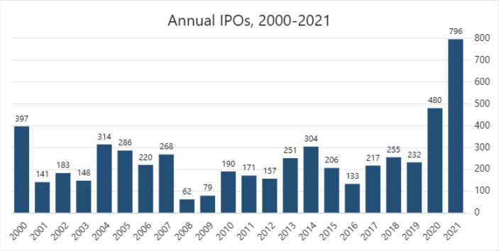

## Analysis of Social Chatter vs Market Results, Post IPO
---
### Executive Summary / Project Description
Prior to filing an initial public offering(IPO), a privately held company's value is largely a guess.  While the company needs to meet IPO criteria, by providing insight into income, assets, revenue growth, etc. Pre-IPO companies don't have any feedback or demonstrated buyer history to measure the immediate purchase of its shares at a particular price.   

This analysis measures social queues to market movements in an attempt to find a correlation. Our analysis reviews social chatter for 90 days from the IPO launch to see if it could be used as a mechanism to determining future stock fluctuations and/or trading volume. The overall motivation for this project was the general excitement in the uptick of IPO’s and the curiosity of finding a way to validate or predict market prices and volumes.

---
### Technologies
**[SNScrape](https://github.com/JustAnotherArchivist/snscrape)**  
**Python 3.8** - Required for SNSscrape  
**Python 3.7** - Required for hvPlot  
**Jupyter Labs**  
  
***Python Libraries Used***  
pandas  
pathlib  
os  
dotenv  
alpaca_trade_api  
collections  
sqlalchemy  
hvplot.pandas  
matplotlib.pyplot  

---
### Installation Guide
Visit the **[SNScrape](https://github.com/JustAnotherArchivist/snscrape)** github repository for information on installing the software.  
Visit the step-by-step guide [here](https://algotrading101.com/learn/alpaca-trading-api-guide/) if you require an Alpaca API key.
The rest of the libraries can be installed through pip commands if running Python through Anaconda.

---
### Usage
***To review the analysis:***
Begin in the [Final_Project_Analysis](https://github.com/jake-viss/UWFintech_Project1/tree/main/Final_Project_Analysis) github repository with the overall review found in the jupyter lab file titled, "Final_Project_Analysis".

To drill down deeper into how the data was aquired, cleaned, and individually analyzed you can review each project members work file which is linked at the top of the "Final_Project_Analysis". 

### Appendix list of stocks used   
| Company | IPO Date | Ticker |
| :--- | :--- | :---:| 
|Oatly	|5/20/2021	|OTLY|
|Air BNB 	|12/10/2020	|ABNB|
|Esports Technologies 	|4/15/2021	|EBET|
|LegalZoom 	|06/30/2021	|LZ|
|F45 Training  	|7/15/2021	|FXLV|
|Upstart Holdings	|12/16/2020	|UPST|
|Bumble 	|2/11/2021	|BMBL|
|Regencell Bioscience 	|7/16/2021	|RGC|
|Sprinklr	|6/23/2021	|CXM|
|DigitalOcean	|3/24/2021	|DOCN|
|Skydeck Acquisition Corp	|1/28/2021	|SKYA|
|Coupang	|3/11/2021	|CPNG|
|Vizio	|3/25/2021	|VZIO|
|Duolingo	|7/28/2021	|DUOL|
|VTEX	|7/21/2021	|VETX|

---
### Contributors
Jacob Vissering - jake.vissering@gmail.com
Viny Nair  
Niki Van Dyck

### License
MIT License
